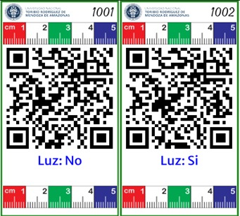
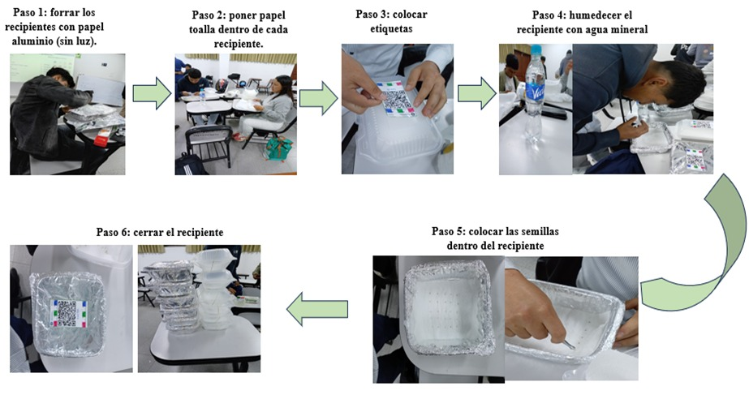
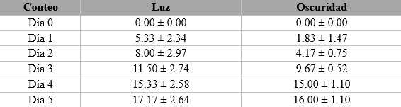
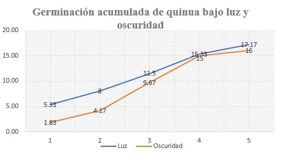

## Título

Experimento de germinación: humedad, luz y temperatura del cultivo de quinoa (Chenopodium quinoa Willd.)

## AUTORES - Galoc Valqui Hermes - Maldonado Ticliahuanca Helkin - Ramos Briceño Ivan - Villa Tochon Jorge Luis - Zagaceta Mendoza Gisella

:::::: {style="text-align: justify;"}
## 1. INTRODUCCIÓN

La quinua (Chenopodium quinoa Willd.) es uno de los cultivos Andinos de mayor relevancia agronómica y alimentaria por su elevada calidad nutricional, su aporte de proteínas, fibra, vitaminas, minerales y compuestos bioactivos, así como por su capacidad para adaptarse a diversos ambientes de producción (Campos-Rodriguez et al., 2022). En términos fisiológicos, la etapa de germinación constituye el proceso más importante en el establecimiento uniforme del cultivo, ya que de ello depende la emergencia oportuna y el vigor inicial. La respuesta germinativa de la quinua puede modificarse por factores externos como la disponibilidad de agua, la temperatura y las condiciones lumínicas, mientras que factores internos como la dormancia y la viabilidad de la semilla también influyen en la velocidad y regularidad del proceso. En este contexto, la luz representa un factor de interés experimental porque puede acelerar, retrasar o no alterar la germinación según la especie y las características del lote de semillas (McGinty et al., 2021). Por ello, el presente trabajo se realizó mediante un Diseño Completamente al Azar, donde se tuvo como objetivo evaluar el comportamiento germinativo de semillas de quinua bajo dos tratamientos, luz y oscuridad, a fin de determinar si la exposición lumínica influye en la dinámica de germinación. Se planteó una hipótesis de que las semillas expuestas a luz presentarían una germinación inicial más rápida que aquellas bajo oscuridad, aunque ambas condiciones podrían alcanzar valores finales cercanos bajo condiciones adecuadas de humedad.

## 2.  MATERIALES Y MÉTODOS

  2.1. Elaboración de etiquetas Para identificar los tratamientos, se generaron etiquetas usando el paquete huito de R, que permite crear etiquetas personalizadas. Previamente se hizo la libreta de campo usando la plataforma Tarpuy, para facilitar el diseño experimental. Los datos de los tratamientos como el número, variedad, dosis, fecha y observaciones, se registraron en una hoja de cálculo de Google Sheets y luego se importaron a R mediante el paquete Googlesheets4. Durante la elaboración de las etiquetas, se incorporaron dentro de estas, algunos datos como el nombre y logo de la universidad, además del nombre del factor, que en este caso es de luz.
    

   {width=60% fig-align="center"}
    

La práctica se desarrolló empleando recipientes plásticos, papel toalla como sustrato de germinación, papel aluminio para el tratamiento en oscuridad, agua mineral, jeringa para la aplicación de agua mineral, pinza, cinta scotch, ligas y regla para el seguimiento de las unidades experimentales. Se seleccionaron 300 semillas de quinua con apariencia uniforme y sin daños visibles, las cuales se distribuyeron en las 12 unidades experimentales, bajo un diseño completamente al azar de acuerdo a la información descrita en el fieldbook del ensayo. En cada recipiente se acondicionó un sustrato húmedo de papel toalla, manteniendo la humedad durante todo el periodo de evaluación mediante aplicaciones controladas de agua. Las unidades correspondientes al tratamiento de oscuridad fueron cubiertas completamente con papel aluminio para impedir el ingreso de luz, mientras que las del tratamiento con luz permanecieron expuestas a condiciones ambientales normales. La variable registrada fue el número acumulado de semillas germinadas por unidad experimental durante los primeros cinco días.

**Figura 1.** *Pasos del experimento*

::: {style="text-align: center;"}
{width="60%"}
:::

## 3. RESULTADOS Y DISCUSIONES

### 3.1. Comportamiento germinativo acumulado

Los conteos acumulados evidenciaron una respuesta inicial más rápida en el tratamiento con luz. Como se observa en la tabla 1, en el primer día, el promedio de semillas germinadas fue de 5.33 ± 2.34 en luz y de 1.83 ± 1.47 en oscuridad. En los conteos intermedios la superioridad del tratamiento con luz se mantuvo, con promedios de 8.00 ± 2.97 y 11.50 ± 2.74 semillas germinadas en los días 2 y 3, mientras que en oscuridad se registraron 4.17 ± 0.75 y 9.67 ± 0.52 semillas, respectivamente. Hacia el día 5, la diferencia entre tratamientos se redujo, aunque el tratamiento con luz conservó el mayor valor final, con 17.17 ± 2.64 semillas germinadas frente a 16.00 ± 1.10 en oscuridad. Este patrón indica que la luz influyó principalmente sobre la velocidad inicial del proceso y en menor magnitud sobre la germinación acumulada final.

**Tabla 1:** *Promedios y desviación estándar de semillas germinadas acumuladas de quinua bajo luz y oscuridad.*

::: {style="text-align: center;"}
{width="60%"}
:::

La tendencia temporal resumida en la en la siguiente figura, confirma que el tratamiento con luz aceleró la emergencia en las etapas tempranas y que la oscuridad no impidió la germinación, sino que retrasó su acumulación germinativa. En ese sentido, este comportamiento indica que la semilla evaluada no depende exclusivamente de la luz para germinar, aunque si mostró una respuesta favorable a la presencia de luz en las fases iniciales.

**Figura 2.** *Curva de germinación acumulada promedio de semillas de quinua bajo luz y oscuridad.*

::: {style="text-align: center;"}
{width="60%"}
:::

### 3.2. Discusión de los resultados

Los resultados del presente ensayo tienen coherencia de acuerdo a la literatura técnica disponible para la quinua. La validación metodológica de la International Seed Testing Association establece para Chenopodium quinoa pruebas de germinación en papel, a 20 °C, con primer conteo al día 4 y 7, confirma que la evaluación de esta especie exige seguimiento temprano y uniforme para detectar diferencias en la velocidad de germinación (ISTA, 2021). Asimismo (Chilo et al., 2009) y (González et al., 2017) demostraron que la temperatura modifica la tasa y el porcentaje de germinación de la quinua, mientras que (McGinty et al., 2021) destacan que la dormancia varían según el genotipo y el ambiente. En ese contexto, la ventaja observada en el tratamiento con luz puede interpretarse como un efecto favorable cobre la activación germinativa inicial, aunque la convergencia parcial de ambos tratamientos en los conteos del día 5, sugiere que la semilla fue viable también en ausencia de luz.

## 4. CONCLUSIONES

La evaluación de germinación de quinua bajo luz y oscuridad permitió comprobar que ambos tratamientos sostuvieron germinación acumulada alta, pero la presencia de luz favoreció una respuesta más rápida durante los primeros conteos. El tratamiento con luz presentó valores promedio superiores desde el inicio del seguimiento y alcanzó el mayor promedio final, mientras que la oscuridad mostró una emergencia más lenta y una menor variabilidad final. En consecuencia, la hipótesis planteada se acepta parcialmente, ya que la luz no fue indispensable para que ocurriera la germinación, pero sí constituyó un factor favorable para acelerar el proceso y mejorar el desempeño inicial de las semillas. Desde el punto de vista metodológico, los resultados confirman la importancia de realizar conteos sucesivos, mantener humedad homogénea y registrar con precisión las condiciones ambientales, debido a que pequeñas variaciones pueden modificar la velocidad germinativa. Finalmente, la práctica permitió integrar observación experimental, registro de campo y contraste bibliográfico, concluyéndose que la germinación de quinua responde de manera sensible a las condiciones de evaluación y que el tratamiento con luz representó la condición más adecuada dentro del ensayo realizado.
::::::

## 5. REFERENCIAS BIBLIOGRAFICAS

Campos-Rodriguez, J., Acosta-Coral, K., Paucar-Menacho, L. M., Campos-Rodriguez, J., Acosta-Coral, K., & Paucar-Menacho, L. M. (2022). Quinua (Chenopodium quinoa): Composición nutricional y Componentes bioactivos del grano y la hoja, e impacto del tratamiento térmico y de la germinación. Scientia Agropecuaria, 13(3), 209-220. <https://doi.org/10.17268/sci.agropecu.2022.019>

Chilo, G., Vacca Molina, M., Carabajal, R., & Ochoa, M. (2009). Efecto de la temperatura y salinidad sobre la germinación y crecimiento de plántulas de dos variedades de Chenopodium quinoa. Agriscientia, 26(1), 15-22.

González, J. A., Buedo, S. E., Bruno, M., & Prado, F. E. (2017). Quantifying Cardinal Temperatures in Quinoa (Chenopodium quinoa) Cultivars. Lilloa, 179-194.

ISTA. (2021). Method Validation Reports on Rules Proposals for the International Rules for Seed Testing 2022 Edition. <https://www.seedtest.org/api/rm/7F9MRTM7HN94JU5/ista-method-validation-reports-2021.pdf>

McGinty, E. M., Murphy, K. M., & Hauvermale, A. L. (2021). Seed Dormancy and Preharvest Sprouting in Quinoa (Chenopodium quinoa Willd). Plants, 10(3). <https://doi.org/10.3390/plants10030458>
